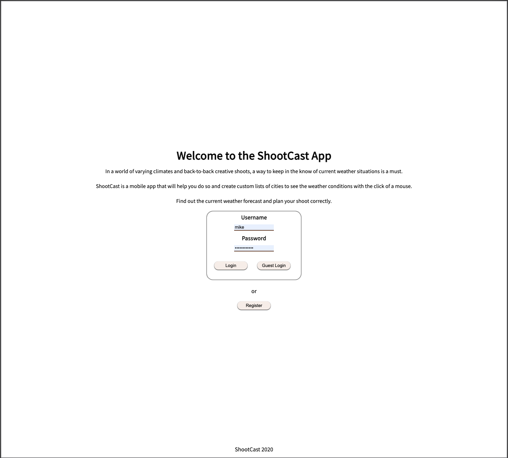
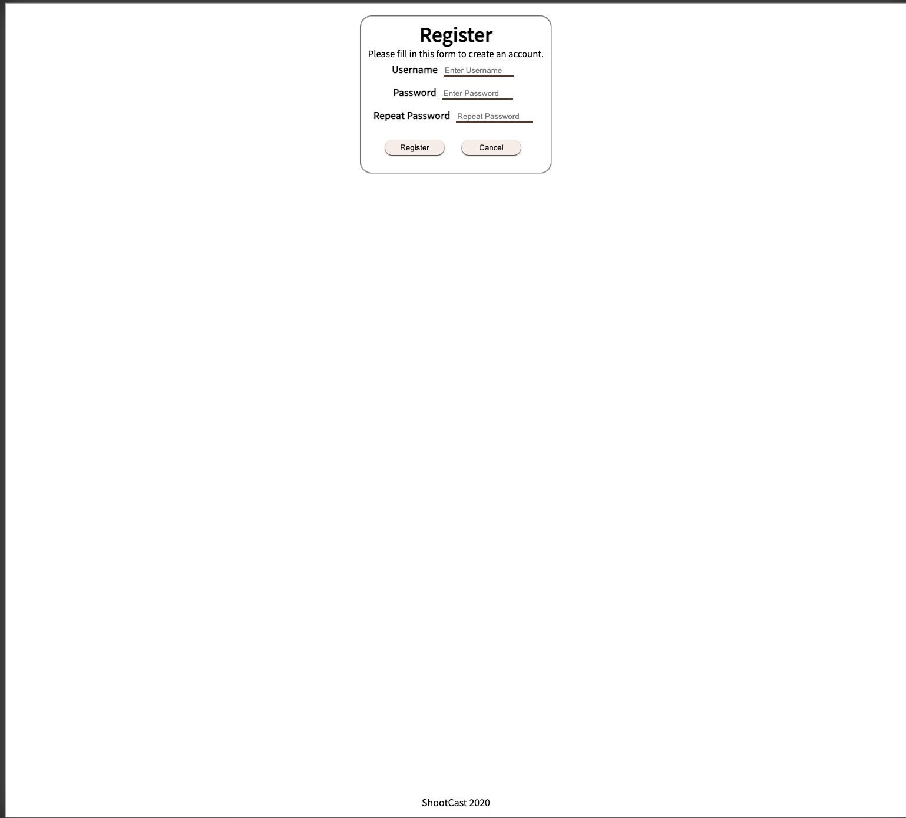

# ShootCast App

## Live Link to App: https://shootcast-app.vercel.app/

### Documentation:

[ Base URL: https://shootcast-app.vercel.app/]

Get request for the list of lists
>GET /api/lists  

Method:&nbsp;&nbsp;`GET`  
Code:&nbsp;&nbsp;`200 OK`  
Content example:  
>{  
&nbsp;&nbsp;&nbsp;&nbsp;"id": "1",  
&nbsp;&nbsp;&nbsp;&nbsp;"name": "Custom List"  
>}

  

>GET /api/cities  

Method:&nbsp;&nbsp;`GET`  
Code:&nbsp;&nbsp;`200 OK`  
Content example: 
>{  
&nbsp;&nbsp;&nbsp;&nbsp;"id": "1",    
&nbsp;&nbsp;&nbsp;&nbsp;"name": "San Francsico"  
&nbsp;&nbsp;&nbsp;&nbsp;"list_id": "1"  
>}

  

POST request to create a new list item.
>POST /api/lists  

Method:&nbsp;&nbsp;`POST`  
Code: `201 CREATED`  
Content Example:  
Provide name of list.  ID will be created in database.  Submitted as JSON data.
>{  
&nbsp;&nbsp;"name": "New Custom List"  
>}  

  

>POST /api/cities  

Method:&nbsp;&nbsp;`POST`  
Code: `201 CREATED`  
Content Example:  
Provide name of city.  ID will be created in database.  "list_id" must be selected from dropdown options.  Submitted as JSON data.
>{  
&nbsp;&nbsp;"name": "Castro Valley",  
&nbsp;&nbsp;"list_id": "1"  
>} 

  

>DELETE /api/lists/:`id`  
  
Method: `DELETE`  
Code: `204 NO CONTENT`  
Content: {}   
Deletes List item at `id`

  

>DELETE /api/cities/:`id`  
  
Method: `DELETE`  
Code: `204 NO CONTENT`  
Content: {}  
Deletes List item at `id`

  

#### Technologies Used:  PostgreSQL, Express, ReactJS. Node.js, JavaScript, Fetch API, HTML, CSS

ShootCast is a mobile app that will help you do so and create custom lists of cities to see the weather conditions with the click of a mouse.

Endpoint: `/landing` || Here the user is able to login with credentials or Guest Login.  
  

Endpoint: `/registration` || Here the user is able to register a new user account.  
  

Endpoint: `/home` || Here the user is able to view the Home Component.  

